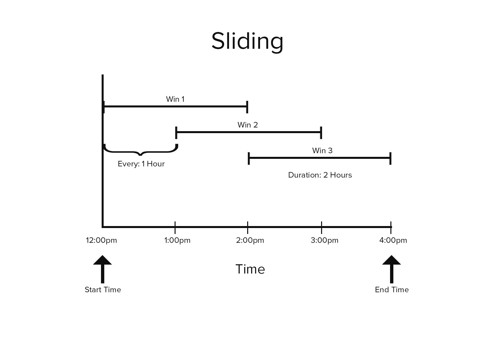
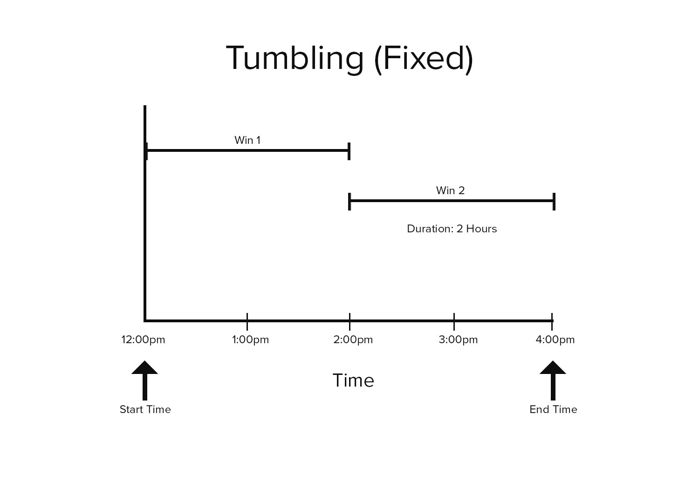

# ScaleOut Time Windowing Library for Java

## Introduction

The ScaleOut Time Windowing Library for Java provides a set of
windowing functions for time-ordered Lists of events. These
windowing functions are provided as static methods that can
operate on any `List<T>` collection.

### Example

    import com.scaleoutsoftware.streaming.timewindowing.*;
	
    class HeartRate {
		...
		// class info
		... 
		public long getTimestamp();
		public short getBeatsPerMinute;
	}

    // given heart-rate readings every minute, calculate the 5-minute
	// moving average of a person's heart rate for the past 24 hours
	List<HeartRate> readings = [...time-ordered readings populated here, one per minute]
	long end = [...current time]
	long start = end - 86400000; // go back 24 hours in Millis
	long every = 60000;
	long duration = 300000;
	
    Iterable<TimeWindow<HeartRate>> slidingWindows = Windowing.toSlidingWindows(
		readings,
		heartRate -> heartRate.getTimestamp(),
		start,
		end,
		duration,
		every);

	// print each window's boundaries and its heartbeat average:
    for (TimeWindow<HeartRate> window in slidingWindows) {
		System.out.println(String.format("start: %d end: %d", window.getStartTime(), window.getEndTime()));
		window.forEach(heartRate -> System.out.print(String.format("HeartRate: %d", heartRate.getBeatsPerMinute())));
	}
        
	
The library provides convenience classes for management of
collections of time-ordered elements. These classes offer automatic
eviction and ordering of elements, and they are suited for scenarios
where elements are only accessed and analyzed as a windowed
transformation. See the [Wrapper Classes](#WrapperClasses) section for
details.

## Windowing Methods

Three methods are provided to break up an iterable collection into
different kinds of time windows. These are available as static
methods in the `com.scaleoutsoftware.streaming.timewindowing.Windowing` class:

1. toSlidingWindows:
   Transforms a collection into an iterable collection of overlapped
   (sliding) windows.
2. toTumblingWindows:
   Transforms a collection into an iterable collection of
   fixed-duration, non-overlapping windows.
3. toSessionWindows:
   Transforms a collection into an iterable collection of session
   windows.
   
The windowing methods accept a user-defined lambda that returns the
time associated with each element in the
collection. This timestamp is used to determine which window (or
windows, in the case of the sliding windows) an element belongs
to. The collection _must_ be sorted chronologically with respect to
the returned timestamp.

Each method returns a collection of
**[TimeWindow](https://scaleoutsoftware.github.io/TimeWindowingJava/com/scaleoutsoftware/streaming/timewindowing/TimeWindow.html)**
objects. A `TimeWindow` instance is itself an iterable collection
of the elements in the source collection whose timestamps fall within
the window's time span.

### Sliding Windows

Sliding window functions are often used to calculate the moving
average of time series data. The duration of sliding windows is larger
than the period between the windows, so the period of time covered by
each window overlaps with its neighbors:

If no elements fall in a sliding time window, that window will be
empty (an empty Iterable).

To use the library's
**[toSlidingWindows](https://scaleoutsoftware.github.io/TimeWindowingJava/com/scaleoutsoftware/streaming/timewindowing/Windowing.html#toSlidingWindows-java.util.List-com.scaleoutsoftware.streaming.timewindowing.TimestampSelector-long-long-long-long-)**
method, the source collection *must* be sorted chronologically. (See
the [Wrapper Classes](#WrapperClasses) section below for details on
convenient wrapper classes that keep your source collection sorted.)

    public static <T> Iterable<TimeWindow<T>> toSlidingWindows(
		List<T> source, 
		TimestampSelector<T> selector, 
		long start, 
		long end, 
		long duration, 
		long every) 

**Parameters**
<dl>
<dt>source</dt><dd>The sequence of elements to transform.</dd>
<dt>selector</dt><dd>An interface to extract a timestamp from an element.</dd>
<dt>startTime</dt><dd>Start time (inclusive) of the first sliding window.</dd>
<dt>endTime</dt><dd>End time (exclusive) for the last sliding window(s).</dd>
<dt>windowDuration</dt><dd>Duration of each time window. This is a maximum value that will be shortened for the last window(s) in the returned sequence.</dd>
<dt>every</dt><dd>The period of time between the start of each sliding window.</dd>
</dl>

### Tumbling Windows

Tumbling windows, (or "fixed" windows), divide time series data into
periodic, non-overlapping windows. Unlike sliding time windows, an
element in a collection of tumbling windows may only appear in a
single window.

If no elements fall in a tumbling time window, that window will be
empty.

To use the library's
**[toTumblingWindows](https://scaleoutsoftware.github.io/TimeWindowingJava/com/scaleoutsoftware/streaming/timewindowing/Windowing.html#toTumblingWindows-java.util.List-com.scaleoutsoftware.streaming.timewindowing.TimestampSelector-long-long-long-)**
method, the source collection *must* be sorted chronologically. (See
the [Wrapper Classes](#WrapperClasses) section below for details on
convenient wrapper classes that keep your source collection sorted.)

    public static <T> Iterable<TimeWindow<T>> toTumblingWindows(
		List<T> source,
		TimestampSelector<T> selector,
		long start,
		long end, 
		long duration) 

**Parameters**
<dl>
<dt>source</dt><dd>The sequence of elements to transform.</dd>
<dt>selector</dt><dd>An interface to extract a timestamp from an element.</dd>
<dt>startTime</dt><dd>Start time (inclusive) of the first tumbling window.</dd>
<dt>endTime</dt><dd>End time (exclusive) for the last tumbling window.</dd>
<dt>windowDuration</dt><dd>Duration of each time window. This is a maximum value that will be shortened for the last window in the returned sequence.</dd>
</dl>

### Session Windows

The duration of a session window is not fixed; rather, it is
determined by the time interval between elements: if a period of idle
time elapses between elements then a new session window is
created.

Session windowing is often used when processing click data or
other types of user activity--if a user is inactive for too long then
the session window closed. A new session window is created once user
activity resumes.

Unlike sliding and tumbling window functions, a session window is
never empty.

Like the other windowing fuctions, the
**[toSessionWindows](https://scaleoutsoftware.github.io/TimeWindowingJava/com/scaleoutsoftware/streaming/timewindowing/Windowing.html#toSessionWindows-java.util.List-com.scaleoutsoftware.streaming.timewindowing.TimestampSelector-long-long-long-)**
method requires the source collection to be sorted
chronologically. (See the *Wrapper Classes* section below for details
on convenient wrapper classes that keep your source collection
sorted.)

    public static <T> Iterable<TimeWindow<T>> toSessionWindows(
		List<T> source,
		TimestampSelector<T> selector
		long idleThreshold)

**Parameters**
<dl>
<dt>source</dt><dd>The sequence of elements to transform.</dd>
<dt>timestampSelector</dt><dd>A function to extract a timestamp from an element.</dd>
<dt>idleThreshold</dt><dd>Maximum allowed time gap between elements before a new session window is started.</dd>
</dl>

## Wrapper Classes

In addition to the static methods detailed above, the library
provides wrapper classes to aid in the management and processing
of time-ordered events. The
**[SessionWindowCollection](https://scaleoutsoftware.github.io/TimeWindowingJava/com/scaleoutsoftware/streaming/timewindowing/SessionWindowCollection.html)**,
**[SlidingWindowCollection](https://scaleoutsoftware.github.io/TimeWindowingJava/com/scaleoutsoftware/streaming/timewindowing/SlidingWindowCollection.html)**,
and
**[TumblingWindowCollection](https://scaleoutsoftware.github.io/TimeWindowingJava/com/scaleoutsoftware/streaming/timewindowing/TumblingWindowCollection.html)**
classes wrap a source List (ArrayList will provide the best performance) and manage its elements.

These wrapper classes are intended to be used as alternatives to the
library's static methods when the underlying elements are accessed
primarily as a windowed collection. It is therefore expected that the
elements in the underlying source collection will only be accessed and
modified through the chosen wrapper. These wrappers perform the
following work on your behalf:

* **Eviction:** Eviction of elements is automatically handled, as
  specified by the policy passed into the wrapper's
  constructor. Eviction is performed when the wrapper collection is
  constructed and when new items are added through the a wrapper's
  `Add()` method.
* **Ordering:** When elements are added through a wrapper's `Add()`
  method, it is inserted into the underlying collection in the correct
  chronological position.
  
Once constructed, the wrapper can be iterated over to access its
associated time windows.

### Sliding Window Wrapper

The `SlidingWindowCollection<T>` class provides the following constructor:

    public SlidingWindowCollection(
		List<T> source, 
		TimestampSelector<T> selector, 
		long windowDuration, 
		long every, 
		long startTime) 

The parameters to this constructor are similar to the parameters to
the `toSlidingWindows` method, except that the `startTime`
parameter defines the eviction policy for the collection as well as
the starting point for the windowing transform--elements with
timestamps prior to `startTime` will be removed from the source
collection.

Also, there is no `endTime` parameter in the wrapper's constructor
like there is in the `toSlidingWindows` method. When iterating
through sliding windows exposed by the wrapper, the end time is
implicitly set to the last (most recent) element in the source
collection.

Once constructed, the wrapper's `add()` method should be used to add
elements to the source list.

### Tumbling Window Wrapper

The `TumblingWindowCollection<T>` class provides the following constructor:

    public TumblingWindowCollection(
		List<T> source, 
		TimestampSelector<T> selector,
		long windowDuration, 
		long startTime)

The parameters to this constructor are similar to the parameters to
the `toTumblingWindows` method, except that the `startTime`
parameter defines the eviction policy for the collection as well as
the starting point for the windowing transform. Elements with
timestamps prior to `startTime` will be removed from the source
collection.

Also, there is no `endTime` parameter in the wrapper's constructor
like there is in the `toTumblingWindows` method. When iterating
through windows exposed by the wrapper, the end time is implicitly set
to the last (most recent) element in the source collection.

Once constructed, the wrapper's `add()` method should be used to add
elements to the source list.

### Session Window Wrapper

The `SessionWindowCollection<T>` class provides the following constructor:

    public SessionWindowCollection(
		List<T> source, 
		TimestampSelector<T> selector,
		long startTime,
		long idleThreshold)

The parameters to this constructor are similar to the parameters to
the `toTumblingWindows` method, except that the `startTime`
parameter defines the eviction policy for the collection as well as
the starting point for the windowing transform. Elements with
timestamps prior to `startTime` will be removed from the source
collection.

Also, there is no `endTime` parameter in the wrapper's constructor
like there is in the `toTumblingWindows` method. When iterating
through windows exposed by the wrapper, the end time is implicitly set
to the last (most recent) element in the source collection.

Once constructed, the wrapper's `add()` method should be used to add
elements to the source collection instead of adding elements directly
to the source collection. If the wrapper's `add()` operation results
in the creation of a new session window then it may evict elements in
accordance to the wrapper's `startTime` policy.

This library is open source and has no dependencies on other ScaleOut 
Software products. 

License: Apache 2 